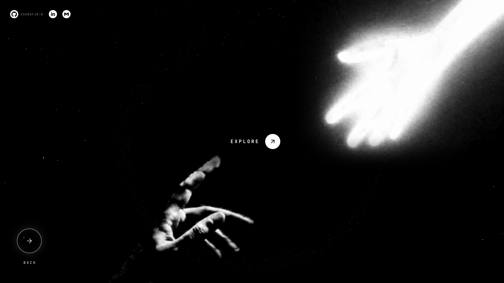

# ashraf

My personal portfolio. A figure balances on a rope down the middle of the
screen: night and a turning ring of stars on one side, a blue sky and a ring of
clouds on the other. Pick a side and the rope slides away. Night brings two
reaching hands and **EXPLORE**, which opens the projects. Day brings three
statements and **CONTACT**. Each visit opens on a short 0–99 count.




## Built with

- **[Three.js](https://threejs.org)**: the WebGL starfield, around 20,000 stars
  on their own orbits, and the cloud ring
- **TypeScript**: vanilla and `strict`, with no UI framework
- **[Vite](https://vite.dev)**: dev server and build
- **Plain CSS**: design tokens, layout and every transition, with no CSS
  framework
- **Space Grotesk** and **JetBrains Mono**, from Google Fonts
- **Lucide** and **Simple Icons**: the icon paths are embedded inline, so there
  is no icon package

No animation library either: one `requestAnimationFrame` loop and CSS
transitions.

## Running it

```sh
npm install
npm run dev      # dev server
npm run check    # scene-timing self-checks
npm run build    # typecheck, then a production build
```

## Projects

The projects page reads a single list, `PROJECTS` in `src/ui/projects.ts`,
which holds each project's name, link, screenshot, short note and stack. The
screenshots live in `public/assets/projects/`.

`prefers-reduced-motion` is honoured: the rings hold still and every
transition is instant.

## Credits

"[Cloud Ring](https://sketchfab.com/3d-models/cloud-ring-27897026b0a24dfe992ca761a4029d01)"
by [RandyGF](https://sketchfab.com/RandyGF), licensed under
[CC BY 4.0](http://creativecommons.org/licenses/by/4.0/).
