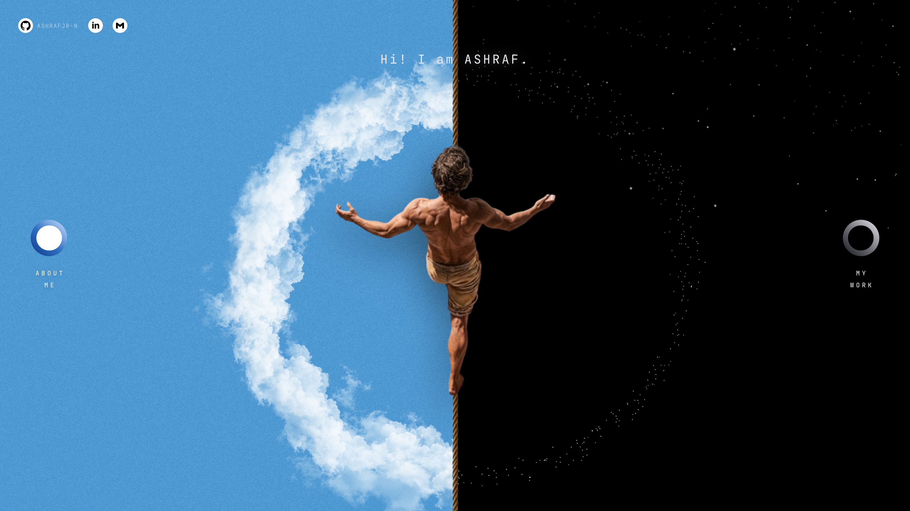
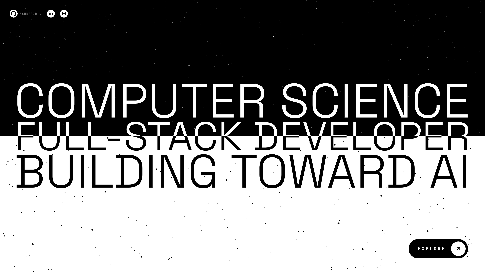

# ashraf

My personal portfolio: one scrolled page in three scenes over a live WebGL
starfield. A ring of stars comes apart as you scroll, three statements slide in
and fill, and a white half rises to invert everything under it. **EXPLORE**
then opens the projects. Each visit opens on a short 0–99 count.





## Built with

- **[Three.js](https://threejs.org)**: the WebGL starfield, around 20,000 stars
  on their own orbits
- **TypeScript**: vanilla and `strict`, with no UI framework
- **[Vite](https://vite.dev)**: dev server and build
- **Plain CSS**: design tokens, layout and every transition, with no CSS
  framework
- **Space Grotesk** and **JetBrains Mono**, from Google Fonts
- **Lucide** and **Simple Icons**: the icon paths are embedded inline, so there
  is no icon package

No animation library either. The scroll position drives everything on the page:
one `requestAnimationFrame` loop and a single spring on the scroll.

## Running it

```sh
npm install
npm run dev      # dev server
npm run check    # scene-timing self-checks
npm run build    # typecheck, then a production build
```

## Projects

The projects page reads a single list, `PROJECTS` in `src/ui/projects.ts`,
which holds each project's name, link, screenshot, short note and stack. The
screenshots live in `public/assets/projects/`.

`prefers-reduced-motion` is honoured: nothing moves unless you scroll.
